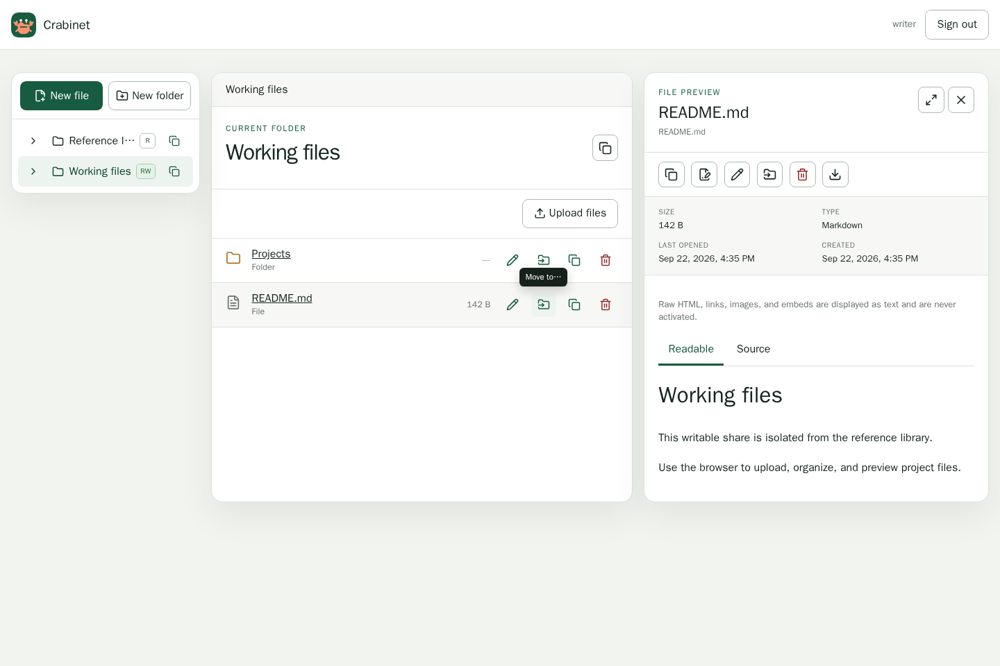

# Crabinet

Crabinet is a security-focused, low-memory file browser for a small server or Podman pod. It provides configuration-defined users, per-share read or write grants, normal filesystem-backed storage, drag-and-drop uploads, file operations, and bounded previews from one self-contained Rust executable with an embedded Preact interface.

> **Maturity:** pre-1.0. The security model and configuration format are deliberate, but operators should validate resource limits and backup procedures in their own environment before exposing Crabinet to untrusted users.



## What it provides

- Multiple local users with Argon2id password hashes and configuration-defined per-share `read` or `write` grants.
- Capability-scoped filesystem access: configured roots are opened once, request paths stay relative, and symlinks, hard-link aliases, special files, ambiguous paths, and traversal are rejected.
- A lazy share/folder tree, touch-friendly folder picker, file-type icons, copyable virtual paths, folder-first browsing, metadata, conditional and ranged downloads, create/rename/move/delete operations, UTF-8 text editing, and streaming multipart uploads.
- Bounded syntax-highlighted code and text previews, safe Markdown rendering without raw HTML, signature-validated raster image previews, and rendered/source HTML tabs with isolated new-tab views. Rendered HTML is protected by a deny-by-default response CSP and, in-panel, an additional empty iframe sandbox, so uploaded scripts, forms, navigation, and network requests cannot run.
- Event-driven refreshes for the open directory through a bounded authenticated server-sent-events stream backed by a non-recursive kernel watch; Crabinet does not scan the share to detect changes.
- Opaque server-side sessions in SQLite, session-bound CSRF protection, same-origin enforcement, bounded login attempts, and `Secure; HttpOnly; SameSite=Strict` cookies.
- A single statically linked Linux binary for `amd64` and `arm64`, plus a `scratch`-based non-root OCI image published to GHCR.
- CI-enforced Rust and frontend tests, dependency policy, Semgrep, Trivy, weekly scans, SBOMs, checksums, and build-provenance attestations.

Crabinet v1 intentionally does not execute uploaded scripts, follow filesystem links, expose special files, recursively delete directories, move entries between shares, edit binary files, hot-reload configuration, use an external identity provider, or support multiple processes writing the same share. It is not an object-store frontend, collaborative editor, antivirus scanner, or substitute for host backups and filesystem permissions.

## Architecture

The Axum/Tokio backend owns authentication, authorization, bounded streaming, and capability-scoped filesystem operations. Preact and TypeScript are build-time dependencies; Vite's output is embedded in the Rust executable, so production has no Node process. Files remain in mounted share directories. SQLite stores only runtime session state. One immutable TOML file defines users, grants, paths, and limits; only the configuration file's path can be selected through the CLI or `CRABINET_CONFIG`.

Start with the [threat model](docs/threat-model.md), [architecture decisions](docs/architecture-decisions.md), and [filesystem invariants](docs/filesystem-security.md) before changing a security boundary. The HTTP behavior used by the frontend is documented in [browse](docs/browse-api.md), [mutation](docs/mutations.md), [preview](docs/previews.md), and [frontend contract](docs/frontend-api-contract.md) notes; these describe the current first-party API, not a stable third-party compatibility promise.

## Direct-binary quick start

Release archives contain the executable, license, README, annotated configuration, and JSON Schema. Linux `x86_64` and `aarch64` are supported; other operating systems and libc targets are not release targets. The commands below describe Crabinet-branded releases; prereleases published before the rename retain their original `index` artifact names.

```sh
curl -LO https://github.com/joanfabregat/crabinet/releases/download/v0.1.0/crabinet-v0.1.0-linux-amd64.tar.gz
curl -LO https://github.com/joanfabregat/crabinet/releases/download/v0.1.0/SHA256SUMS-amd64
sha256sum --check SHA256SUMS-amd64
tar -xzf crabinet-v0.1.0-linux-amd64.tar.gz
cd crabinet-linux-amd64
./crabinet --help
```

Replace `v0.1.0` with an existing release tag. Before trusting an artifact, also verify its GitHub build attestation:

```sh
gh attestation verify crabinet-v0.1.0-linux-amd64.tar.gz \
  --repo joanfabregat/crabinet
```

Prepare paths outside every share, generate a session secret, and create a password hash interactively:

```sh
install -d -m 0700 ./state ./secrets
umask 077
head -c 32 /dev/urandom > ./secrets/session.key
cp config.example.toml config.toml
./crabinet hash-password
```

Put the resulting PHC string in `config.toml`, set real absolute share paths, then validate and start as the same unprivileged user that will run the service:

```sh
./crabinet check-config --config ./config.toml
./crabinet --config ./config.toml
```

The default example listens only on loopback. `GET /health/live` reports process health and `GET /health/ready` reports readiness. Browser authentication uses a `Secure` cookie, so place Crabinet behind HTTPS for real use; do not expose plain HTTP on a network.

## Configuration

Copy [config.example.toml](config.example.toml) and consult [the configuration guide](docs/configuration.md). The committed [JSON Schema](config.schema.json) is generated by `crabinet print-config-schema` and checked against the implementation in CI.

```toml
version = 1

[server]
listen = "0.0.0.0:8080"
database_path = "/var/lib/crabinet/crabinet.sqlite3"
session_secret_file = "/run/secrets/crabinet/session.key"
max_upload_size = "100 MiB"
max_preview_size = "2 MiB"
auth_max_concurrent = 1

[[users]]
username = "alice"
password_hash = "$argon2id$v=19$m=65536,t=3,p=1$REPLACE_WITH_A_REAL_SALT$REPLACE_WITH_A_REAL_HASH"

[[shares]]
id = "documents"
name = "Documents"
path = "/shares/documents"
read_only = false

[[shares.grants]]
user = "alice"
permission = "write"
```

Generate hashes only with `crabinet hash-password`; clear-text passwords are never accepted in arguments or environment variables. Keep the session secret out of TOML and every share. Crabinet reads configuration and secrets once, validates all roots before listening, rejects unknown fields, and never hot-reloads. Restart after every policy, user, hash, secret, grant, or limit change. Rotating the session secret invalidates all sessions; changing a password hash or disabling/removing a user takes effect after restart.

A share grant is absent-by-default. `permission = "read"` cannot mutate. `permission = "write"` can mutate unless the share's `read_only = true`, which always wins. The OS user must still have matching host permissions. Each writable share receives a private mode-`0700` `.index-staging` directory for atomic uploads and bounded crash recovery; Crabinet never scans the complete share at startup. Writable shares must be mounted into only one Crabinet process; read-only shares create no staging state and may be served by separate read-only replicas.

The `.index-staging` name remains reserved so existing writable shares can be used after upgrading from Index. Keep it in place when renaming the service and its deployment directories. The renamed `crabinet_session` cookie requires users to sign in again; update any deployment setting that uses the old `INDEX_CONFIG` environment variable to `CRABINET_CONFIG`.

## Rootless Podman pod

The image is `ghcr.io/joanfabregat/crabinet:<tag>`. Pin a release digest in production. The image is `scratch`-based, runs without root, and contains only `/crabinet`; it has no shell or package manager.

The following rootless example maps the invoking host user into the pod, keeps the container root filesystem read-only, drops capabilities, and mounts state separately. Adjust SELinux labels for your host. Use `:ro` for every share that does not need writes.

```sh
install -d -m 0700 deploy/state deploy/secrets
install -d -m 0750 deploy/config
umask 077
head -c 32 /dev/urandom > deploy/secrets/session.key
cp config.example.toml deploy/config/config.toml
podman run --rm --interactive --tty \
  ghcr.io/joanfabregat/crabinet:v0.1.0 hash-password
# Put that hash in the copy, enable the user, and use /var/lib/crabinet,
# /run/secrets/crabinet, and /shares paths.

podman pod create \
  --name crabinet \
  --userns=keep-id \
  -p 127.0.0.1:8080:8080

podman run --detach \
  --name crabinet-app \
  --pod crabinet \
  --user "$(id -u):$(id -g)" \
  --read-only \
  --cap-drop=all \
  --security-opt=no-new-privileges \
  --memory=256m \
  --pids-limit=256 \
  -v "$PWD/deploy/config/config.toml:/etc/crabinet/config.toml:ro,Z" \
  -v "$PWD/deploy/secrets:/run/secrets/crabinet:ro,Z" \
  -v "$PWD/deploy/state:/var/lib/crabinet:rw,Z" \
  -v "/srv/documents:/shares/documents:ro,Z" \
  ghcr.io/joanfabregat/crabinet:v0.1.0 \
  --config /etc/crabinet/config.toml
```

For a writable share change only that share mount to `:rw,Z`; never make the configuration or secret mount writable. Ensure the mapped host user can traverse/read each share and can create, rename, sync, and delete inside writable shares. Avoid `:U` unless you explicitly intend Podman to change host ownership.

Check health from the host or a dedicated proxy/monitor container in the pod:

```sh
curl --fail --silent --show-error http://127.0.0.1:8080/health/live
curl --fail --silent --show-error http://127.0.0.1:8080/health/ready
```

Start with a 256 MiB limit and `auth_max_concurrent = 1`. A default Argon2id verification uses about 64 MiB temporarily; configured hashes may use more within enforced bounds. Idle browsing is much smaller, but upload concurrency, directory sizes, allocator behavior, and the platform affect the real peak. Benchmark the exact release under its cgroup limit before reducing memory or increasing authentication concurrency. See [authentication sizing](docs/authentication.md).

## TLS and reverse proxies

Terminate TLS at a reverse proxy and forward to Crabinet over a private loopback, Unix-network namespace, or pod network. Preserve the original `Host` exactly: login, logout, and mutations compare `Origin`/`Referer` authority with `Host`. Do not rewrite these headers. Crabinet intentionally ignores `X-Forwarded-For` and similar client-address headers; its login limiter sees the TCP peer, so a shared proxy should enforce an additional per-client login limit.

Do not publish the backend port beyond the proxy. Apply conservative request-body and timeout limits at the proxy, but keep them at least as large as Crabinet's configured upload size plus multipart framing. Add HSTS at the TLS endpoint after validating HTTPS. No forwarded-header trust list is needed because Crabinet does not consume forwarded client identity; if that behavior changes, it must be an explicit reviewed configuration feature.

## Backup and restore

Back up these as separate classes with restrictive permissions:

- `config.toml`, the session-secret file, and deployment metadata;
- the SQLite file and its `-wal`/`-shm` companions when present;
- every share directory, preserving ownership, modes, timestamps, and extended attributes relevant to your workload.

For a simple consistent backup, stop the Crabinet container, snapshot/copy SQLite and writable shares, then restart. A live filesystem copy is not transactionally consistent with concurrent file mutations; use a storage-level snapshot that covers all writable shares and state together, or accept that they represent different instants. Read-only shares may be copied live according to the underlying application's rules.

Restore while Crabinet is stopped. Restore configuration, secret, SQLite state, and share paths with the same ownership and mount semantics; run `crabinet check-config` before starting. Restoring SQLite without its matching session secret safely invalidates existing cookies but cannot recover those sessions. If session continuity is unimportant, deleting the stopped service's SQLite file starts with no sessions.

## Upgrade and rollback

1. Read the release notes and verify checksums, SBOM, and attestation.
2. Back up state and writable shares, then run the new binary's `check-config` against the production configuration.
3. Pull by digest, stop the old container, and start exactly one new writer.
4. Check both health endpoints, login, each grant class, a representative preview, and a small write on a disposable path.

For rollback, stop the new process before starting the old one. Restore the pre-upgrade SQLite/config snapshot if release notes describe a state or schema change. Never run old and new versions concurrently against a writable share or the same SQLite database.

## Troubleshooting and logs

Crabinet emits structured JSON logs to standard output. Set `RUST_LOG=crabinet=debug` only during controlled diagnosis; logs are designed not to include passwords, password hashes, file contents, host paths, session tokens, or CSRF tokens. Every HTTP response includes `X-Request-ID`; correlate that value with the request span.

- Startup fails before listening: run `crabinet check-config`; verify secret mode/length, database parent existence, absolute non-overlapping share roots, that no sensitive path is inside a share, and that writable share roots permit creation of the private `.index-staging` directory.
- Login succeeds but the browser returns to login: confirm end-to-end HTTPS, preserved `Host`, and matching `Origin`; `Secure` cookies are not for plain network HTTP.
- A user cannot see a share: grants are case-sensitive and absent-by-default; restart after changing the immutable configuration.
- Writes return `403`: verify a `write` grant, `read_only = false`, a current session/CSRF token, and host filesystem permissions.
- Writes return `409`: refresh metadata; Crabinet uses validators to prevent overwriting a concurrently changed target.
- Uploads return `413` or `429`: check Crabinet and proxy limits, upload concurrency, and container memory.
- Preview returns `415` or `413`: the file is binary/invalid UTF-8, unsupported for that preview kind, or exceeds `max_preview_size`; download remains separate and permission-checked.

## Development and security

See [CONTRIBUTING.md](CONTRIBUTING.md) for the containerized Rust/Node workflow and required checks, [development preview](docs/development-preview.md) for the current preview status, and [dependency licensing](docs/dependency-licenses.md) for the enforced policy and release notices. Report vulnerabilities through [GitHub private vulnerability reporting](https://github.com/joanfabregat/crabinet/security/advisories/new), following [SECURITY.md](SECURITY.md); do not open a public issue for an unpatched vulnerability or include active credentials in any report.

Crabinet is released under the [MIT License](LICENSE).
