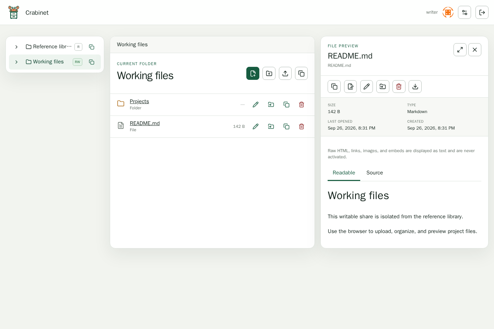

# Crabinet

**A self-hosted web file browser in a single Rust binary.**

Browse existing folders on your Linux server, upload and manage files, and preview documents in your browser. Give each user read or write access to selected shares. Run one executable with the Preact interface embedded, or use the non-root container image with [rootless Podman](docs/operations.md#rootless-podman-pod).

Crabinet started as a small project to replace File Browser. Ideas, feature suggestions, and [bug reports](https://github.com/joanfabregat/crabinet/issues) are welcome and help shape its development.

[Get started](#get-started) · [Configuration](docs/configuration.md) · [Operator guide](docs/operations.md) · [Releases](https://github.com/joanfabregat/crabinet/releases) · [Contribute](CONTRIBUTING.md)

> **Pre-1.0:** configuration and behavior may change between releases. Review release notes, test resource limits, and validate backups for your installation before exposing it to untrusted users.

## What you can do

- **Browse your existing files.** Files remain in normal server directories. Navigate a folder tree, show hidden files when needed, and download files with range support, or whole folders and any selection of files and folders as streamed ZIP archives.
- **Upload and organize.** Drag and drop uploads, create folders, rename and move entries within a share, edit UTF-8 text, and move files or folders to Trash with restore support.
- **Preview before downloading.** Read highlighted code and text, rendered GitHub Flavored Markdown, and HTML with rendered/source views. See the first page of a PDF, play audio and video, and view photos as server-rendered thumbnails, including the embedded previews of camera RAW files such as DNG, NEF, and CR2. Open images, PDFs, and text in a new tab in the browser's own viewer, or download them. Preview sizes are bounded; HTML previews block scripts and network requests.
- **Choose who gets access.** Configure users and per-share read or write grants. Sign in with a password or OpenID Connect, and optionally enroll passkeys.
- **Use it across devices.** A touch-friendly folder picker, start-folder preferences, hidden-file settings, and appearance preferences follow your account. The open directory refreshes when filesystem changes are detected.

## Why Crabinet?

Crabinet suits a small Linux server where you want browser access to selected folders with an explicit access policy and one application process to run.

- **One executable.** The Axum/Tokio backend serves the embedded frontend. Production needs no Node process or separate database server; SQLite holds sessions, preferences, and passkeys, and rendered thumbnails are cached in a private directory beside it. PDF rendering and image decoding are built in, with no helper processes or C image libraries.
- **Configuration-defined access.** One TOML file defines users, shares, grants, and limits. Grants are absent by default, enforced on the server, and changed by restarting with a validated configuration.
- **Explicit filesystem boundaries.** Configured roots are opened once and requests stay relative to those roots. Symlinks, hard-link aliases, special files, ambiguous paths, and traversal are rejected. See the [filesystem security design](docs/filesystem-security.md) and [threat model](docs/threat-model.md).
- **Bounded resource use.** Uploads and downloads stream; previews and authentication concurrency have explicit limits, and image thumbnails decode within one configured memory budget. The container example starts at 256 MiB with one password verifier. A default Argon2id verification temporarily uses about 64 MiB; measure your workload before changing limits. See [authentication sizing](docs/authentication.md).
- **Verifiable releases.** Static Linux binaries for `amd64` and `arm64`, a `scratch`-based non-root OCI image, checksums, SBOMs, and build-provenance attestations. CI runs tests, dependency checks, and security scans.

Users, grants, and sign-in settings are managed in configuration. Writable shares must have exactly one Crabinet writer. Moving entries between shares, following filesystem links, and hot-reloading configuration are unsupported. See the [configuration guide](docs/configuration.md) for deployment constraints.

## Get started

You need a Linux `amd64` or `arm64` server, directories the service user can access, and an HTTPS reverse proxy for browser use. Configuration, secrets, and SQLite state must live outside every share.

| Install | Start here |
| --- | --- |
| **Linux binary** | Download an archive from [Releases](https://github.com/joanfabregat/crabinet/releases/latest), verify its checksum and attestation, and follow the [binary quick start](docs/operations.md#direct-binary-quick-start). |
| **Rootless container** | Use the non-root image `ghcr.io/joanfabregat/crabinet:<tag>` with separate mounts for shares, configuration, secrets, and state. Follow the [rootless Podman example](docs/operations.md#rootless-podman-pod). |

Both paths use the same setup:

1. Copy [config.example.toml](config.example.toml). Set absolute share paths and each user's read or write grants.
2. Create a session-secret file and generate a password hash with `crabinet hash-password`. Replace the example hash and set the example user's `disabled` flag to `false`.
3. Run `crabinet check-config --config ./config.toml`, then `crabinet --config ./config.toml` as an unprivileged user.
4. Place the service behind HTTPS, preserving the original `Host`, and sign in through the proxy.

The example listens on loopback. Browser sessions use `Secure` cookies; follow the [TLS and reverse proxy guide](docs/operations.md#tls-and-reverse-proxies) for network use. The operator guide includes the complete download, directory, secret, and container commands.

## Documentation

| Topic | Guide |
| --- | --- |
| Configuration, grants, and limits | [Configuration](docs/configuration.md), [annotated example](config.example.toml), [JSON Schema](config.schema.json) |
| Passwords, OpenID Connect, passkeys, and account pictures | [Authentication](docs/authentication.md) |
| Installation, proxies, backups, upgrades, and troubleshooting | [Operating Crabinet](docs/operations.md) |
| Security boundaries and implementation choices | [Threat model](docs/threat-model.md), [filesystem security](docs/filesystem-security.md), [architecture decisions](docs/architecture-decisions.md) |
| Uploads, file operations, and Trash | [Mutations](docs/mutations.md) |
| Supported previews and their limits | [Previews](docs/previews.md) |
| Frontend and HTTP behavior | [Browse API](docs/browse-api.md), [frontend contract](docs/frontend-api-contract.md) |
| Upgrading an installation from before the rename | [Staging cutover](docs/staging-cutover.md) |

Account pictures can make browser requests to Google or, when enabled, Gravatar. See [account pictures](docs/authentication.md#account-pictures) for the privacy implications and configuration.

## Contributing and security

Ideas, feature suggestions, bug reports, usability feedback, documentation improvements, and focused contributions are welcome. [Open an issue](https://github.com/joanfabregat/crabinet/issues) to share an idea or report a bug. See [CONTRIBUTING.md](CONTRIBUTING.md) for the containerized Rust/Node workflow and required checks. The HTTP API is documented for the first-party frontend; it is not a stable third-party compatibility promise.

Report vulnerabilities through [GitHub private vulnerability reporting](https://github.com/joanfabregat/crabinet/security/advisories/new), following [SECURITY.md](SECURITY.md).

## License

Crabinet is released under the [MIT License](LICENSE). Bundled dependencies retain their own terms, collected in [Third-party licenses](THIRD_PARTY_LICENSES.md); see the [dependency licensing policy](docs/dependency-licenses.md).
