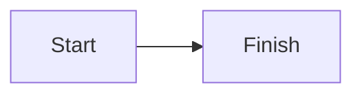
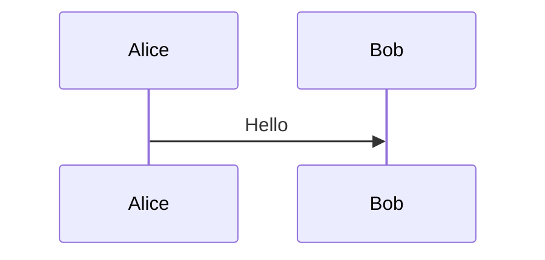

# Diagrams

A flowchart:

```mermaid
flowchart LR
  A[Start] --> B[Finish]
```

A sequence:

```mermaid
sequenceDiagram
  Alice->>Bob: Hello
```

Invalid diagrams keep their source:

```mermaid
this is not a diagram
```
